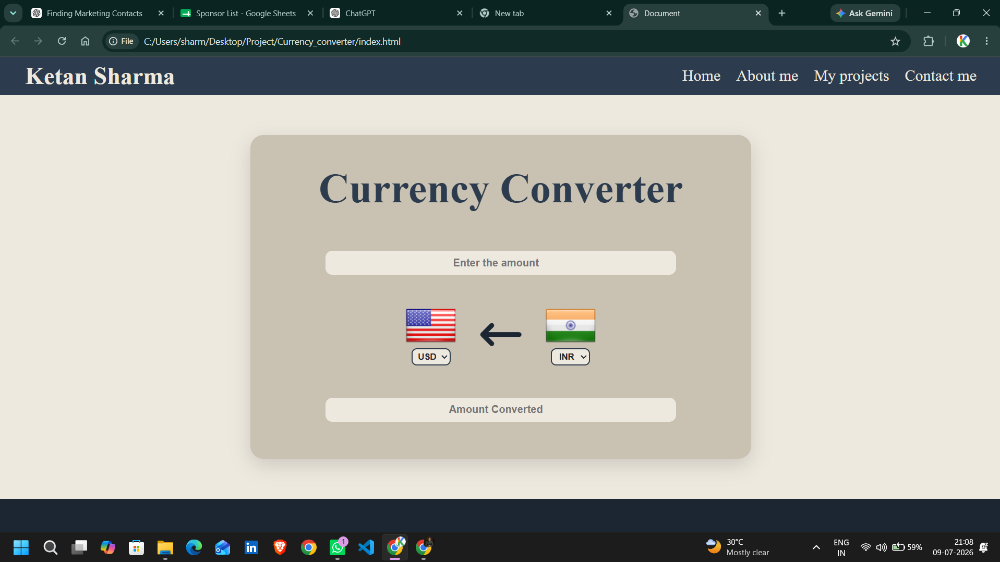
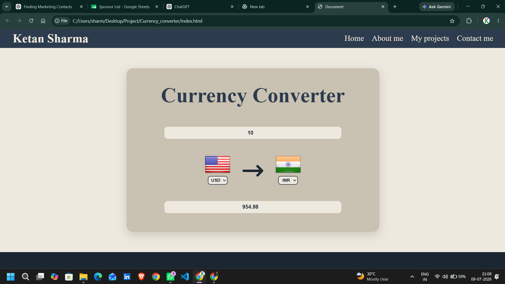

# 💱 Currency Converter

A simple Currency Converter built using **HTML**, **CSS**, and **JavaScript**. It fetches live exchange rates using **Fawaz Ahmed's Currency API** and allows users to convert between multiple currencies with dynamically updated country flags.

## 📸 Screenshots

### Home Page



### Currency Conversion



---

## ✨ Features

- Convert between multiple currencies
- Live exchange rates
- Dynamic country flags
- Simple and clean user interface
- Fast and lightweight

---

## 🛠️ Tech Stack

- HTML5
- CSS3
- JavaScript (ES6)
- Fetch API

---

## 🌐 APIs Used

- **Currency API:** https://github.com/fawazahmed0/currency-api
- **Flags API:** https://flagsapi.com/

---

## 🚀 Getting Started

1. Clone this repository.
2. Open `index.html` in your browser.
3. Enter an amount, choose currencies, and convert.

---

## 📂 Project Structure

```
currency-converter/
│
├── images/
│   ├── home.png
│   └── conversion.png
├── index.html
├── style.css
├── script.js
└── README.md
```

---

## 🙏 Acknowledgements

- Fawaz Ahmed for the free Currency API.
- FlagsAPI for country flag images.
- Font Awesome for icons.

---

## 👨‍💻 Author

**Ketan Sharma**

GitHub: https://github.com/ketansharma-ops
